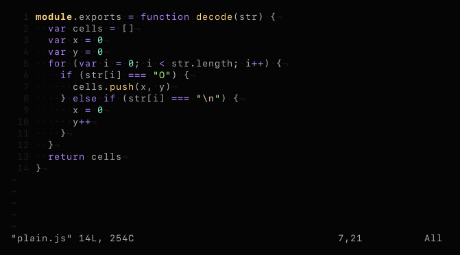

# vim-colors-synthetic
> minimal vim color scheme

## install
Copy `colors/synthetic.vim` to your `~/.vim/colors` directory, or add "semibran/vim-colors-synthetic" using a plugin manager of your choice.

## usage
`:colorscheme synthetic`
