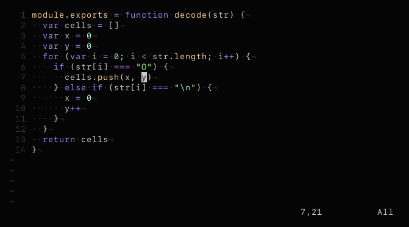

# vim-colors-synthetic
> minimal vim color scheme

`synthetic` is designed with the intention of minimizing the number of colors found in highlighted code snippets while still creating a worthy separation between tokens. It uses four major colors for the following purposes:
* **purple** for statements and keywords
* **yellow** for identifiers and keys
* **green** for constants like strings and numbers
* **cyan** for functions and special characters

## install
Copy `colors/synthetic.vim` to your `~/.vim/colors` directory, or add `"semibran/vim-colors-synthetic"` using a plugin manager of your choice.

## usage
`:colorscheme synthetic`
