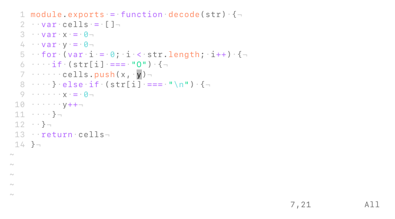

# vim-colors-synthetic
> minimal vim color scheme

`synthetic` is a color scheme designed with the intention of minimizing the number of colors found in highlighted code snippets while still creating a worthy separation between tokens. It utilizes four primary colors for the following purposes:
* **purple** for statements
* **yellow** for identifiers
* **green** for constants
* **cyan** for miscellaneous tokens

## install
Copy `colors/synthetic.vim` to your `~/.vim/colors` directory, or add "semibran/vim-colors-synthetic" using a plugin manager of your choice.

## usage
`:set background=dark`
`:colorscheme synthetic`
