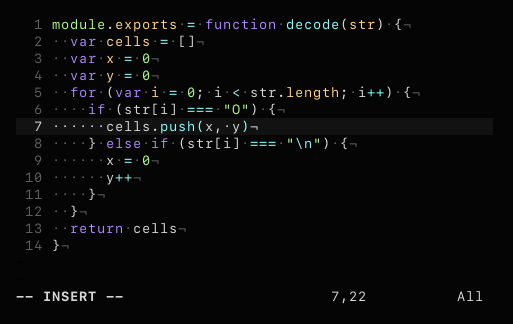

# vim-colors-synthetic
> minimal vim color scheme

`synthetic` is a syntax theme designed with the goal of minimizing the number of colors found in highlighted code while still maintaining a worthy visual separation between tokens.

## palette
| color                         | hex value | usage                                  |
| :---------------------------: | :-------: | :--------------------------------------- |
|   | `#af87ff` | statements, keywords, control flow       |
|   | `#ffd787` | identifiers, variables, keys, props      |
|     | `#afff87` | constants, builtins, strings, numbers    |
|       | `#87ffff` | functions, operators, special characters |
|         | `#ff5f5f` | errors                                   |

## install
Copy `colors/synthetic.vim` to your `~/.vim/colors` directory, or add `"semibran/vim-colors-synthetic"` using a plugin manager of your choice.

## usage
`:colorscheme synthetic`
